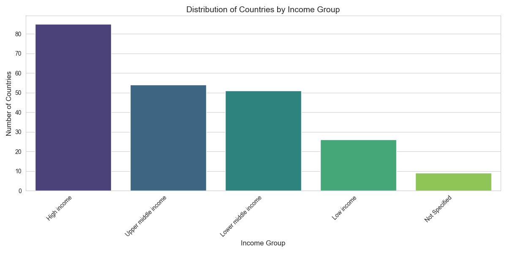
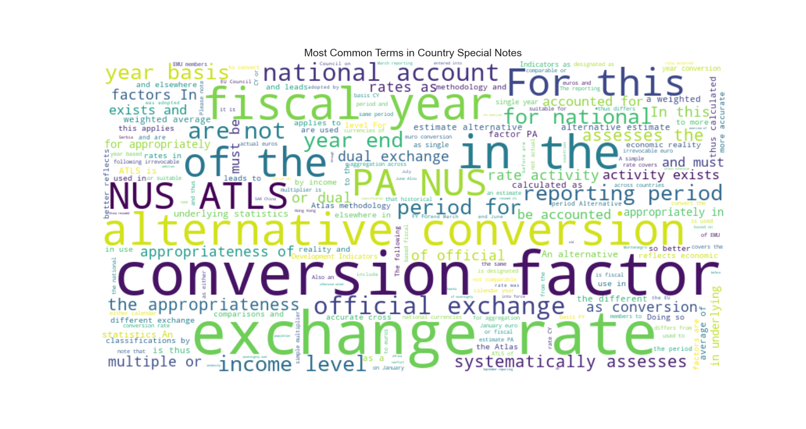

# 🌍 Country Metadata Analysis - World Bank Data 📊



## 📌 Overview

This project analyzes country metadata from the World Bank, with powerful insights about:

- 🌐 Distribution of countries by income groups and regions
- 📝 Deep analysis of special notes for each country
- 💱 Identification of dual/multiple exchange rate systems
- 📅 Fiscal year systems analysis

## 🗂 Project Structure

```
project/
├── data/ 📁
│   └── Metadata_Country_API_SP.POP.TOTL_DS2_en_csv_v2_19373.csv
├── scripts/ 💻
│   ├── data_loading.py
│   ├── basic_analysis.py
│   ├── notes_analysis.py
│   ├── advanced_analysis.py
│   └── main.py
├── output/ 📊
│   ├── visualizations/ 🖼
│   └── reports/ 📄
├── requirements.txt
└── README.md
```

## ⚙️ Requirements

- Python 3.7+
- Required packages:
  ```
  pandas==1.3.4 🐼
  matplotlib==3.4.3 📈
  seaborn==0.11.2 🎨
  wordcloud==1.8.1 ☁️
  python-dateutil==2.8.2 ⏳
  ```

## 🚀 How to Run

1. Clone the repository:
   ```bash
   git clone [repository URL]
   cd project
   ```

2. Install requirements:
   ```bash
   pip install -r requirements.txt
   ```

3. Run the analysis:
   ```bash
   python scripts/main.py
   ```

## 📊 Outputs

The analysis generates:

- `output/visualizations/` 🖼:
  - Country distribution by income 💰
  - Geographic distribution 🌎
  - Special notes word cloud ☁️
  - And more!

- `output/reports/` 📄:
  - Dual exchange rate countries 💱
  - Fiscal year analysis 📅
  - Final results JSON 📑

## 🔍 Sample Results

### 💱 Dual Exchange Rate Countries
| Country Code | TableName          | Region                 | IncomeGroup     |
|--------------|--------------------|------------------------|-----------------|
| AFG          | Afghanistan        | South Asia             | Low income      |
| ARG          | Argentina          | Latin America & Caribbean | Upper middle income |

### 💰 Income Distribution


### ☁️ Special Notes Analysis


## ✨ Key Features

1. **🧹 Data Cleaning**:
   - Handles missing values ❓
   - Text normalization ✂️
   - Filters regional aggregates 🌐

2. **📊 Basic Analysis**:
   - Income/region distributions 📈
   - Interactive heatmaps 🔥

3. **📝 Notes Analysis**:
   - Smart categorization 🏷️
   - Word clouds ☁️
   - Year extraction 📅

4. **🔍 Advanced Analysis**:
   - Fiscal year detection 📅
   - Currency change tracking 💱
   - Note length analysis 📏

## 👥 Contributors

- [Your Name] 👨💻 - Lead Developer

## ⚖️ License

MIT License © 2023
